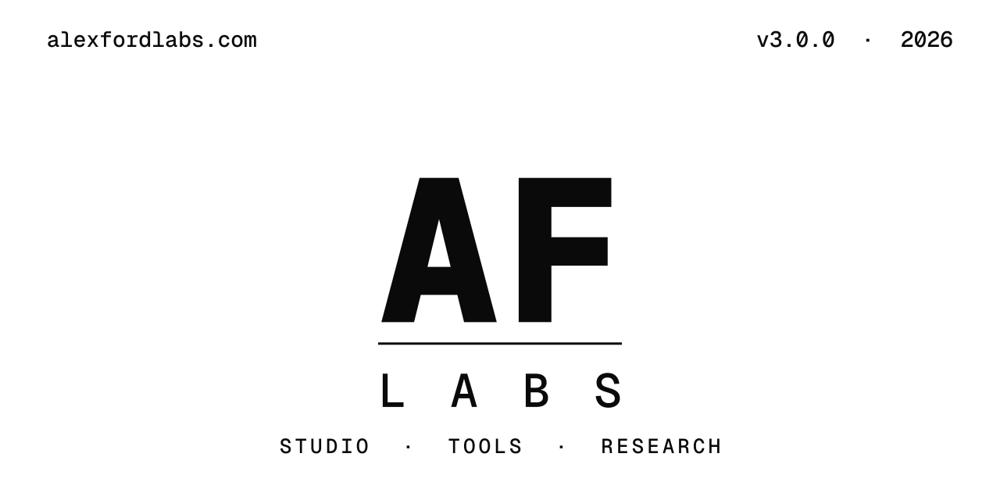

<!--
Author: Alexander Ford <alex@alexfordlabs.com>
Repository: https://github.com/alexfordlabs/project-architect
License: MIT
-->

<p align="center">
  
</p>

<div align="center">

# project-architect

**An orchestrator skill that designs and bootstraps any software project end-to-end, inside Claude Code.**

From _"I want to build X"_ to a fully-committed project: design docs, ADRs, root and per-folder `CLAUDE.md`, a stack-aware `.claude/` configuration, and router slash commands — all interviewed, decided, and written for you.

[](LICENSE)
[](https://github.com/alexfordlabs/project-architect/releases)
[](https://github.com/alexfordlabs/project-architect)
[](https://github.com/alexfordlabs/project-architect/commits/main)
[](.claude-plugin/plugin.json)
[](tests/)

</div>

---

`project-architect` is a [Claude Code](https://claude.com/claude-code) plugin that turns the messy front half of a project — _what am I building, on what stack, with what architecture, and why_ — into a guided, research-backed conversation that ends with real artifacts on disk.

You invoke one skill. It interviews you across **12 phases**, dispatches **7 specialist subagents** to research and write in parallel, files an **Architecture Decision Record** for every choice you make, runs a **35-check, 4-tier mechanical quality gate** over what it produced, and hands off a project that already has its design documented, its `CLAUDE.md` written, and its `.claude/` tooling configured. It works for web apps, CLIs, libraries, mobile, APIs, games, AI/ML, infrastructure, MCP servers, Claude Code plugins, even the design of a new programming language — **19+ project types** in all.

It is **design-first and snapshot-safe**: nothing is destroyed, every milestone is versioned, and an event-sourced state log lets you stop and resume across sessions. When you come back to an old or interrupted project, it recognizes the situation and offers the right way forward instead of starting over.

## Capabilities

- **A 12-phase interactive bootstrap.** Preflight → Universal Kickoff → Vision & Scope → **Architecture** → **Tech Stack** → Cost Modeling → Document Generation → Iteration → Lock → Tooling Execution → Handoff → Complete. Architecture is decided *before* the tech stack (domain shape first, infrastructure second). Each phase is research-augmented and produces concrete output.
- **7 specialist subagents.** `research-scout` (fetches current docs, `llms.txt`, best practices, and prior art), `architecture-specialist` (chooses the architectural style + boundaries before the stack, with an explicit anti-microservices-by-default guard), `document-author` (writes design docs in parallel), `claude-md-author` (authors the `CLAUDE.md` router + per-folder files), `claude-tooling-author` (writes `.claude/` settings, hooks, agents, and commands with inline validators), `decision-revisor` (reworks a decision and supersedes its ADR), and `design-recovery` (reconstructs an existing project's design into a reviewable artifact). The quality gate is now an in-process command (`architect-brain audit`), not a subagent.
- **A 35-check, 4-tier mechanical quality gate** (`architect-brain audit`). Checks run in-process (Python) across four severities — **FATAL** (blocks lock unconditionally), **BLOCKING** (blocks unless explicitly acknowledged), **WARNING**, **INFO** — covering link integrity, ADR coverage, JSON/YAML validity, placeholder/TODO scanning, ISO-8601 timestamps, schema validity, the replay invariant, catalog acyclicity, required-docs presence, and more. Gates are *enforced* at phase transitions and before lock — not advisory.
- **ADR-tracked decisions.** Every meaningful choice becomes a sequentially-numbered Architecture Decision Record, written inline as you decide, with a supersession chain when you revise.
- **Per-folder `CLAUDE.md` + `.claude/` tooling generation.** A root `CLAUDE.md` router plus folder-specific files where conventions differ, and a stack-aware `.claude/` directory (settings, hooks, subagents, slash commands) tuned to your decisions.
- **Event-sourced, multi-file state.** A single `bin/architect-brain` binary records every mutation as an event in an append-only `events.jsonl`; the per-concern projections, a flat decision index, and the ADR ledger are a pure replay of that log (schema 4.0, with `replay(events) == projections` enforced as a FATAL check). It stamps real timestamps from its own clock, migrates pre-v8 state forward (`architect-brain migrate`, reversible), and is the canonical entry point for resuming a project across sessions.
- **Cross-version `/upgrade-project`.** Bring a project bootstrapped by an older project-architect forward to the current format — snapshot, migrate state, reconcile the ADR ledger, re-derive (or preserve) docs, re-gate to green, re-lock at a bumped version. Nothing is lost.
- **Ingest-and-rethink `/re-architect`.** Point it at a mature, docs-rich project: it recovers the design, lets you triage every decision (keep / revise / drop / add), researches the deltas *and challenges the keeps* with fresh sources, re-decides, and re-derives every artifact. Snapshot-first, branch-isolated, never rewrites your code.
- **A Preflight situation-router.** Open a folder that already has architect history — a state file, prior docs, an interrupted run on another branch — and Preflight *assesses* the full situation (recorded state + folder inventory + every git branch, strictly read-only) and *routes* you to the right flow: **resume** an interrupted run, **upgrade** an old design, **re-architect** in place, or **start fresh from a seeded greenfield** (Vision and Tech Stack pre-filled from what it recovered). It never blindly re-enters a phase.
- **Self-healing error handling.** On a blocker, the orchestrator surfaces a concise *informational error state* — what failed, what's known so far, what's at risk — then asks you to choose: **report and stop** (a clean, documented halt with the snapshot intact) or **self-heal and continue** (apply a remediation it derives from the situation, after you approve it). No silent skips, no raw traces dumped into the transcript.
- **A fast, quiet, beautiful run.** The bootstrap opens with an ASCII banner (`architect-brain ui banner`) and leads every phase boundary with an advancing block-char progress bar (`Phase 3/11  [████░░░░░░░░░░░░░░░░]  27%  Architecture`, printed by `architect-brain ui phase-bar`) plus `✓`/`→`/`✗` step lines, so you watch the design fill from Preflight to Handoff. The mechanical chatter (event writes, gate JSON, `find`/`grep`) stays captured, never dumped into your transcript.
- **19+ project types**, including first-class **programming-language design** (general-purpose, DSL, query, configuration, educational, transpiler target) with 7 dedicated design templates.

## Install

`project-architect` ships from the shared **`alexfordlabs`** Claude Code marketplace — the same one-marketplace, two-plugin setup it shares with its companion [`reverse-engineer`](https://github.com/alexfordlabs/reverse-engineer).

> **Requirements:** **Python 3.10+** available as `python3` — the local `architect-brain` engine runs on every invocation, and Preflight hard-stops with a clear message on a missing/older interpreter — plus `git` for repo init. Check with `python3 --version`. (On macOS, confirm `python3` resolves to 3.10+, not an older system Python.)

```bash
# 1. Add the marketplace to your Claude Code installation
claude plugin marketplace add alexfordlabs/skills

# 2. Install the plugin
claude plugin install project-architect@alexfordlabs

# 3. Install the one REQUIRED companion. It's declared as a dependency, so Claude
#    Code usually installs it automatically; if it doesn't, run this explicitly:
claude plugin install commit-commands@claude-plugins-official

# 4. (Optional) Verify the install
claude plugin validate
```

The plugin **requires** `commit-commands` (from the official Claude plugins marketplace) for its per-batch commit cadence — the bootstrap skill won't start without it. See [Recommended companion plugins](#recommended-companion-plugins) for the optional rest.

## Commands & workflows

`project-architect` is one main skill plus four router commands that the bootstrap generates into your project's `.claude/commands/`. Each is below: **what it does**, **when to use it**, and an **example**.

### `project-architect` — the bootstrap

**What it does.** Runs the full 12-phase interview, dispatches the subagents, files ADRs, generates the design docs and the four plan docs, runs the quality gate, locks the design at `v1.0`, and (optionally) executes the plans to write your `CLAUDE.md` and `.claude/` tooling. This is the entry point for a brand-new project — *and* the smart resume point for an existing one (Preflight's situation-router takes over when it detects prior history).

**When to use it.** Starting a new project; or returning to a project the architect previously touched (it will assess and route you).

**Example** — in a fresh project directory:

```text
/effort max
/model            → the latest Opus (1M context)
/project-architect
```

### `/scaffold` — write the skeleton from the plan

**What it does.** Reads `docs/SCAFFOLD_PLAN.md` and builds the codebase skeleton — build manifest, `src/` tree, license, toolchain pin, bootstrap commands — by handing off to `superpowers:writing-plans` + `subagent-driven-development`. It runs a version-awareness gate first, so an outdated design is surfaced before any code is written.

**When to use it.** Right after the design is locked, when you're ready to turn the `SCAFFOLD_PLAN` into actual files.

**Example:**

```text
/scaffold
```

### `/implement <feature>` — build one feature against the requirements

**What it does.** Implements a named feature from `docs/PROJECT_REQUIREMENTS.md`, test-driven, against the locked design. Like `/scaffold`, it checks design freshness first.

**When to use it.** Iteratively, once scaffolded — one feature at a time, each as its own focused, reviewable change.

**Example:**

```text
/implement user-authentication
```

### `/iterate-design` — re-open the locked design for revision

**What it does.** Re-launches the architect against your *locked* design to revise it in place: it unlocks, runs the `decision-revisor` loop (reworking decisions and superseding their ADRs), re-gates, and re-locks at a bumped version (`v1.0 → v1.1`). Progress is recorded per step so an interrupted iteration can be resumed.

**When to use it.** When a decision needs to change after lock but the project is still on the current format — a targeted in-place revision, not a from-scratch rethink.

**Example:**

```text
/iterate-design
```

### `/upgrade-project` — bring an old-format project to current

**What it does.** Detects a project bootstrapped by an *older* project-architect and migrates it forward: snapshot the old state → migrate the state schema → reconcile the ADR ledger from disk → re-derive (or, for narrative pre-v5 projects, **preserve**) the docs → re-gate to green → re-lock at a bumped version. Every generated artifact is stamped so the project stays perpetually forward-migratable. Runs on an `upgrade/architect-<date>` branch with a clean fast-forward merge offered at the end.

**When to use it.** When you have a project the architect produced under an earlier release and you want it on the current format without re-interviewing it.

**Example:**

```text
/upgrade-project
```

### `/re-architect` — recover, rethink, and re-derive a mature project

**What it does.** The deepest revision: **recover** the design from your docs + ADRs into a reviewable `RECOVERED_DESIGN.md` → **triage** every decision (keep / revise / drop / add) → **research** the deltas *and challenge the keeps* with current sources → **re-decide** into the flat decision keyspace → **re-derive** docs, superseding ADRs, `CLAUDE.md`, and tooling from your new answers. Snapshot-first, runs on a `rearchitect/architect-<date>` branch, and **never rewrites your source code** — when a re-decided choice invalidates built code, it emits an affected-areas list and tells you to re-run `/implement` deliberately.

**When to use it.** When a project's design has drifted, or you want to revisit it from first principles with fresh research — turning a narrative, hand-evolved project into a clean, re-derivable one.

**Example:**

```text
/re-architect
```

## Use cases

| Scenario | What you'd run | What you get |
|---|---|---|
| **A new web app** (SaaS, dashboard, marketplace…) | `/project-architect` | Stack chosen with research (framework, DB, auth, hosting), `ARCHITECTURE.md` + `DATABASE_DESIGN.md` + `AUTHENTICATION_SYSTEM.md`, ADRs for each choice, a `CLAUDE.md` router, and `.claude/` tooling tuned to the stack. |
| **A new CLI tool** | `/project-architect` | A language + CLI-framework decision via the per-language UX picker (Rust/Go/Python/Node/Ruby/C#), a `CLI_UX_DESIGN.md`, and a `SCAFFOLD_PLAN.md` ready for `/scaffold`. |
| **A new library / SDK** | `/project-architect` | API-surface design, packaging and distribution decisions, a versioning policy, and docs that make the public contract explicit. |
| **Design a new programming language** | `/project-architect` → choose "programming language design" | The 7 PL design docs — grammar, semantics, type system, stdlib, toolchain, bootstrap plan, stability/RFC — driven by implementation-strategy, host-runtime, paradigm, and type-system decisions. |
| **Bring an old project to the current format** | `/upgrade-project` | A snapshot of the old design, migrated state, a reconciled ADR ledger, preserved-or-re-derived docs, a green quality gate, and a re-locked version — on a branch, ready to merge. |
| **Revisit a mature project's design with fresh research** | `/re-architect` | A recovered design you triage decision-by-decision, deltas researched and keeps challenged against current sources, then every doc/ADR/`CLAUDE.md`/tooling re-derived from your new answers — code untouched. |

## What it generates

A completed bootstrap leaves a project that looks like this:

```text
<your-project>/
├── CLAUDE.md                           ← root router, loaded into every Claude session
├── apps/web/CLAUDE.md                  ← per-folder CLAUDE.md where conventions differ
├── packages/core/CLAUDE.md
├── .claude/
│   ├── settings.json                   ← model + stack-aware permissions + hooks
│   ├── hooks/                          ← lint-on-save, test-on-stop, dangerous-command guard
│   ├── agents/                         ← e.g. test-runner, migration-checker, deploy-verifier
│   ├── commands/                       ← project commands PLUS the router commands:
│   │                                     /scaffold · /implement · /iterate-design
│   └── recommended-plugins.md
└── docs/
    ├── PROJECT_OVERVIEW.md             ← master hub
    ├── PROJECT_REQUIREMENTS.md         ← the feature spec /implement reads from
    ├── ARCHITECTURE.md
    ├── DATABASE_DESIGN.md              ← when a database is present
    ├── AUTHENTICATION_SYSTEM.md        ← when auth is enabled
    ├── CLI_UX_DESIGN.md                ← for CLI/TUI projects
    ├── ... 100+ more conditional templates by project type (a 107-document catalog)
    ├── CLAUDE_MD_PLAN.md               ← Phase 6 plan, materialized in Phase 9
    ├── CLAUDE_TOOLING_PLAN.md          ← Phase 6 plan, materialized in Phase 9
    ├── SCAFFOLD_PLAN.md                ← Phase 6 plan, handed to /scaffold
    ├── NEXT_STEP_PLAN.md               ← post-bootstrap roadmap
    ├── research/                       ← findings gathered by research-scout
    ├── versions/                       ← optional human-readable design snapshots (cp -r at a lock)
    │   └── v1.0/                       ← docs copied at a LOCK milestone
    └── _architect_state/               ← event-sourced state (schema 4.0); entry point for resuming
        ├── events.jsonl                ← the append-only, authoritative event log
        ├── 99-flat-index.json          ← flat decision index + ADR list
        ├── <concern>.json              ← 11 per-concern projections (a pure replay of the log)
        └── decisions/                  ← MADR-4 ADRs, sequential, with a supersession trail
            ├── index.json              ← the ADR ledger projection
            ├── 0001-language-runtime.md
            └── 0007-revisit-database-choice.md
```

In short: **design docs**, **ADRs**, a **root + per-folder `CLAUDE.md`**, a **`.claude/` tooling directory** (settings, hooks, agents, commands), the **four plan docs** (`CLAUDE_MD_PLAN`, `CLAUDE_TOOLING_PLAN`, `SCAFFOLD_PLAN`, `NEXT_STEP_PLAN`), optional versioned **snapshots**, and the **event-sourced architect state** that ties it all together across sessions.

## Guides

### Quick-start walkthrough

1. **Install** the plugin ([Install](#install)) and open a fresh project directory in Claude Code.
2. **Set the engine.** `/effort max` and `/model` → the latest Opus (1M context). The architect verifies this in Preflight; the long interview benefits from the strongest model.
3. **Invoke** `/project-architect`. Preflight runs its checks (model, effort, recommended plugins, version freshness, cache hygiene) and stays quiet on a healthy setup.
4. **Answer the Universal Kickoff.** A short batch of multiple-choice questions classifies the project; the first `research-scout` dispatches in the background.
5. **Work through Vision → Architecture → Tech Stack.** The architect presents type-aware options, researches the gotchas, and files an ADR for each decision as you make it.
6. **Review what it wrote.** Phase 6 (Document Generation) generates the design and plan docs in parallel and runs the quality gate; Phase 7 (Iteration) hands you a menu seeded from the auditor's findings — revise a decision, snapshot, or approve.
7. **Lock and execute.** Phase 8 (Lock) locks the design at `v1.0`; Phase 9 (Tooling Execution) executes the plans to write your `CLAUDE.md` and `.claude/` tooling; Phase 10 (Handoff) prints restart instructions.
8. **Build.** In future sessions, the generated `CLAUDE.md` router exposes `/scaffold`, `/implement <feature>`, and `/iterate-design`.

### The design-first lifecycle

project-architect deliberately separates **deciding** from **building**:

> **bootstrap → iterate → lock → implement**

Phase 6 (Document Generation) emits *plans*, not code — `SCAFFOLD_PLAN.md`, `CLAUDE_MD_PLAN.md`, and friends. Phase 7 (Iteration) lets you edit those plans before anything executes. Phase 8 (Lock) **locks** the design. Only then does code get written — `/scaffold` turns the plan into a skeleton, `/implement` builds features against the locked requirements, and `/iterate-design` (or `/re-architect`) re-opens the design when a decision needs to change. Because every milestone is snapshot-able and every mutation is an event in the log, you can always see what was decided, when, and why.

### Keeping project-architect up to date

Run `/plugin` periodically in any Claude Code session — it detects updates across every installed plugin — then `/reload-plugins` to apply them to the current session.

```text
/plugin
/reload-plugins
```

The CLI form works the same way:

```bash
claude plugin update project-architect@alexfordlabs
/reload-plugins
```

If your installed copy is older than the latest release, Preflight surfaces a one-time notice the next time you invoke the skill, so you'll never start a long bootstrap on a stale version. For zero-poll notification, click **Watch → Releases only** on the [GitHub repo](https://github.com/alexfordlabs/project-architect). See [CHANGELOG.md](CHANGELOG.md) for the version history.

## Project types supported

19+ top-level types, most with several sub-types:

- **Web app** — SaaS / marketplace / dashboard / e-commerce / community / wiki / newsletter / portfolio / internal tool
- **Mobile** — consumer / B2B / enterprise / health / finance / productivity / media
- **Multi-platform system** — web + mobile + desktop + API
- **API service** — REST / GraphQL / gRPC / WebSocket / event-driven / webhook / proxy / scheduled
- **CLI tool** — developer / system utility / data / network-security / package manager / build / scaffolder / REPL
- **Library / SDK** — service SDK / framework / utility / type lib / FFI / code-gen / linter / test lib
- **Desktop** — macOS / Windows / Linux / cross-platform / menu bar / system extension / daemon
- **Browser extension** — Chrome / Firefox / Safari / cross-browser
- **Game** — 2D / 3D / mobile / web / console / VR-AR
- **AI/ML** — training / inference / RAG / agents / vision / NLP / recommendation / time-series / RL / multi-modal
- **Data pipeline** — batch / streaming / ETL / reverse-ETL / CDC / analytics / feature store
- **Embedded / IoT** — Cortex-M / RP2 / ESP32 / STM32 / edge gateway / hardware combo
- **Infrastructure tool** — IaC / CLI / IDP / cluster operator / observability / CI/CD
- **Claude Code plugin** — commands / skills / agents / hooks / full
- **MCP server** — stdio / HTTP-SSE / Cloudflare Workers / other
- **Web3 / smart contracts** — EVM / Solana / Aptos-Sui / Starknet
- **Scientific computing** — numerical / data analysis / reproducible / bio / GIS
- **AR / VR / spatial** — visionOS / Quest / mobile AR / WebXR
- **Programming language design** — general-purpose / DSL / query / config / educational / transpiler target

## Recommended companion plugins

Preflight auto-detects these and notes any that are missing. Only `commit-commands` is required.

| Plugin | Role |
|---|---|
| `commit-commands` _(required)_ | Auto-commit cadence per batch / artifact / phase |
| `superpowers` | `/scaffold` hands `SCAFFOLD_PLAN` to `writing-plans` + `subagent-driven-development` |
| `claude-md-management` | Audits the generated `CLAUDE.md` files |
| `claude-code-setup` | Source of stack → skill recommendations |
| `hookify` | Hook-authoring patterns for the generated `.claude/hooks/` |
| `document-skills` | Writing-quality conventions absorbed by `document-author` |
| `fewer-permission-prompts` | Tightens the generated `.claude/settings.json` permission allowlist |

## Contributing

Contributions are welcome. See [CONTRIBUTING.md](CONTRIBUTING.md) for the full workflow; for substantial changes, open an issue first to discuss the direction.

The plugin is developed test-first — `tests/` ships with it, and the full suite (pure Bash, asserting against the actual plugin files) runs with:

```bash
bash tests/run_all.sh
```

Host tooling: `bash >= 4`, `jq`, `python3 >= 3.10`, `shellcheck`, `gh`, `git`, `curl`. No external test framework is required.

## License

[MIT](LICENSE) — © 2026 Alexander Ford / Alex Ford Labs.

## Attribution

When you use `project-architect`, the generated docs end with:

> *★ Skillfully made with [project-architect](https://github.com/alexfordlabs/project-architect).*

This is a social-norm attribution, not a legal one — please keep it visible in `PROJECT_OVERVIEW.md`, `CLAUDE.md`, and other top-level docs so others can discover the tool. The MIT license doesn't require it, but it's a polite norm and costs you nothing.

If you fork or build on the skill itself, the source-file attribution comments must remain per the MIT terms, and the `LICENSE` file must be included in any redistribution.

> **Publisher.** project-architect is published by **Alex Ford Labs**. The hero image above shows the Alex Ford Labs umbrella mark; the mark, its sizing guide, and all light/dark variants live under [`.github/assets/brand/`](.github/assets/brand/).

---

*★ Skillfully made with [project-architect](https://github.com/alexfordlabs/project-architect).*
