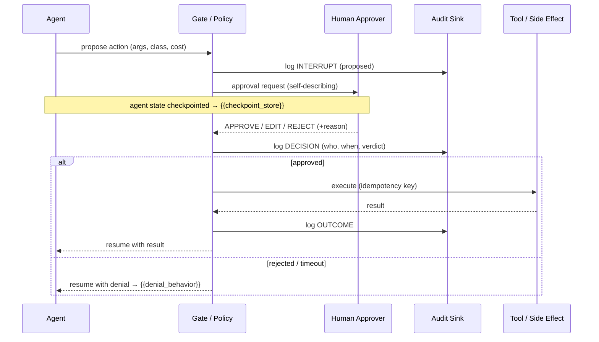

<!--
Author: Alexander Ford <alex@alexfordlabs.com>
Repository: https://github.com/alexfordlabs/project-architect
License: MIT
-->

# Human-in-the-Loop: {{project_name}}

> 📌 **Status:** v{{document_version}} · **Last revised:** {{last_revised_date}} · **ADRs:** {{adr_links}}

> **Why this doc exists.** `{{project_name}}` runs an agent at autonomy level `{{agent_autonomy}}`{{regulated_clause}}. Because the agent is **not fully autonomous** (or operates under regulatory constraints), some of its actions MUST pause for a human decision. This document is the contract for *which* actions gate, *who* approves them, *how* the approval is presented and resumed, and *how* every decision is recorded. It is grounded in the consent-and-control model of the **[MCP Specification 2025-06-18 § Security and Trust & Safety](https://modelcontextprotocol.io/specification/2025-06-18)**, whose first principle is: *"Users must explicitly consent to and understand all data access and operations"* and *"Hosts must obtain explicit user consent before invoking any tool."*

## Table of contents
- [🔐 Consent & Trust Model](#consent-trust-model)
- [🔐 Gating Policy — Which Actions Require Approval](#gating-policy-which-actions-require-approval)
- [Approver & Authority Matrix](#approver-authority-matrix)
- [🔧 Approval UX — Interrupt & Resume](#approval-ux-interrupt-resume)
- [Timeout, Default & Escalation](#timeout-default-escalation)
- [🔐 Audit Trail](#audit-trail)
- [Tool Safety & Trust Boundaries](#tool-safety-trust-boundaries)
- [Failure Modes & Degraded Operation](#failure-modes-degraded-operation)
- [🚦 Verification & Test Plan](#verification-test-plan)
- [↻ Revision Log](#revision-log)

## 🔐 Consent & Trust Model

The governing principle, per **MCP § Security and Trust & Safety → Key Principles**:

1. **User Consent and Control** — the human must explicitly consent to and understand every gated operation and retain control over what is done on their behalf.
2. **Data Privacy** — no resource data crosses a trust boundary (sent to a tool/server/sub-agent) without consent.
3. **Tool Safety** — *"Tools represent arbitrary code execution and must be treated with appropriate caution."* The host obtains explicit consent before invoking any gated tool, and tool descriptions/annotations are treated as **untrusted** unless the providing server is trusted.

State the trust model for `{{project_name}}`:

- **Trusted surfaces** (no per-call gate; pre-authorized once): {{trusted_surfaces}}
- **Untrusted / semi-trusted surfaces** (every side-effecting call gates): {{untrusted_surfaces}}
- **Consent granularity**: {{consent_granularity}} (per-call · per-session · per-tool-class · standing grant with revocation)
- **Consent persistence & revocation**: {{consent_persistence}} — how a granted approval is scoped in time, and how the human revokes a standing grant.

> The autonomy level `{{agent_autonomy}}` sets the *default* posture. This document narrows it: even at the chosen level, the action classes below override the default and force a human gate.

## 🔐 Gating Policy — Which Actions Require Approval

A **gate** is a hard pause: the agent's plan is suspended, a human-approval request is surfaced, and execution does not proceed until an authorized approver responds (or the timeout policy fires). Classify every agent capability into one of: **auto** (proceed silently), **notify** (proceed, but record + inform), **gate** (pause for approval), **deny** (never allowed).

| Action class | Examples in `{{project_name}}` | Disposition | Rationale |
|---|---|---|---|
| Read-only / non-mutating | {{readonly_actions}} | {{readonly_disposition}} | No side effects; lowest risk |
| **Tool calls with side effects** | {{sideeffect_actions}} | **gate** | MCP § Tool Safety: explicit consent before invoking |
| **Irreversible / destructive** | {{destructive_actions}} (delete, drop, overwrite, deploy-to-prod, send-external) | **gate** | No undo; blast radius is permanent |
| **Spend / value transfer** | {{spend_actions}} (purchases, paid API calls over {{spend_threshold}}, payouts) | **gate** | Direct financial exposure |
| **Data egress / privacy boundary** | {{egress_actions}} (sharing user data with an external server or sub-agent) | **gate** | MCP § Data Privacy: consent before exposing user data |
| **Scope/authority escalation** | {{escalation_actions}} (granting permissions, modifying its own gating policy) | **deny** or **gate** | Prevents self-relaxation of controls |
| {{custom_action_class}} | {{custom_actions}} | {{custom_disposition}} | {{custom_rationale}} |

**Gate predicate.** A single, testable rule that decides whether a pending action gates. Express it so it can be unit-tested against a tool-call record:

```
gate(action) := action.side_effects == true
             AND (action.reversible == false
                  OR action.estimated_cost > {{spend_threshold}}
                  OR action.crosses_privacy_boundary == true
                  OR action.class in {{always_gate_classes}})
{{additional_gate_clauses}}
```

> ⚠️ **Untrusted annotation rule (MCP).** Do NOT trust a tool's self-declared `readOnly` / `destructive` annotation to *lower* a gate when the tool comes from an untrusted server. Annotations may raise a gate, never silently remove one.

## Approver & Authority Matrix

Who may approve, for which classes, up to what limit.

| Action class | Primary approver | Authority limit | Fallback approver | Quorum |
|---|---|---|---|---|
| Side-effecting tool calls | {{approver_sideeffect}} | {{limit_sideeffect}} | {{fallback_sideeffect}} | {{quorum_sideeffect}} |
| Destructive / irreversible | {{approver_destructive}} | {{limit_destructive}} | {{fallback_destructive}} | {{quorum_destructive}} |
| Spend | {{approver_spend}} | up to {{spend_cap}}; above → {{spend_escalation_role}} | {{fallback_spend}} | {{quorum_spend}} |
| Data egress | {{approver_egress}} | {{limit_egress}} | {{fallback_egress}} | {{quorum_egress}} |

- **Identity of the approver** is established by {{approver_auth_method}} (the gate is meaningless if the approver isn't authenticated).
- **Separation of duties**: {{separation_of_duties}} — whether the agent's operator and the approver must be distinct principals.
- {{regulated_approver_note}}

## 🔧 Approval UX — Interrupt & Resume

The mechanics of pausing and resuming. Describe the concrete pattern used by `{{project_name}}`'s runtime/orchestrator (`{{ai_orchestration}}`):

- **Interrupt mechanism**: {{interrupt_mechanism}} (e.g. graph interrupt / `interrupt()` checkpoint, queue-and-wait, durable-execution signal, MCP **elicitation** request to the host).
- **What the approver sees** — the request MUST be self-describing per MCP's *"Users should understand what each tool does before authorizing its use"*:
  - the action and target ({{request_action_summary}}),
  - the agent's stated reason / plan step ({{request_rationale}}),
  - the predicted effect and reversibility ({{request_effect}}),
  - estimated cost / blast radius ({{request_cost}}),
  - the exact arguments that will be passed (rendered, not hidden).
- **Decision options**: approve · approve-with-edit ({{edit_allowed}}) · reject-with-reason · defer.
- **Resume mechanism**: {{resume_mechanism}} — how the approved (possibly edited) action re-enters the execution graph; state restored from {{checkpoint_store}} so a pause survives process restart.
- **Idempotency on resume**: {{resume_idempotency}} — guarantee that a resumed action executes exactly once even if the approval signal is delivered twice.



## Timeout, Default & Escalation

A gate that waits forever is a denial-of-service on the workflow. Define the bounded-wait policy:

- **Timeout**: {{approval_timeout}} (after which the **default disposition** fires).
- **Default disposition on timeout**: {{timeout_default}} — and the safe default for any *destructive/spend* class is **reject** (fail-closed), never auto-approve.
- **Escalation ladder**: {{escalation_ladder}} — e.g. primary approver → secondary after {{escalation_t1}} → on-call/owner after {{escalation_t2}}.
- **Re-notification cadence**: {{renotify_cadence}}.
- **Channel(s)**: {{escalation_channels}} (in-app inbox, email, Slack, PagerDuty).
- **Batch / standing approvals**: {{batch_policy}} — whether repeated low-risk gated actions can be approved as a class for a bounded window (with revocation).

## 🔐 Audit Trail

Every gate decision is an auditable event. Per MCP's *"Implementors should provide clear UIs for reviewing and authorizing activities,"* the trail is both the compliance record and the review surface.

- **Audit sink**: {{audit_sink}} (append-only log, structured event store, SIEM, WORM bucket, DB table).
- **Record per gated action** (immutable):
  - correlation id linking proposal → decision → outcome,
  - actor: the agent run id + the human approver identity,
  - the full proposed action (tool, args, class, predicted cost/effect),
  - verdict + reason + any approver edits,
  - timestamps (proposed, decided, executed),
  - the resulting effect / tool result reference.
- **Tamper-evidence**: {{audit_integrity}} (append-only, hash-chained, signed).
- **Retention**: {{audit_retention}}{{regulated_retention_note}}.
- **Privacy of the trail**: {{audit_privacy}} — redaction of secrets/PII in logged arguments (the trail must not become a new data-exfiltration path).
- **Reviewability**: {{audit_review_ui}} — how a human after-the-fact reviews and, if needed, reverses an action.

## Tool Safety & Trust Boundaries

Grounded in **MCP § Tool Safety** — tools are arbitrary code execution.

- **Tool inventory & classification**: {{tool_inventory}} — each tool tagged with side-effects, reversibility, cost, and trust level of its providing server.
- **Sandbox / isolation**: {{agent_sandbox}} (how side-effecting tool execution is contained — network egress allow-list, FS scope, ephemeral credentials).
- **Untrusted-input handling**: {{untrusted_input_handling}} — tool *outputs* and *descriptions* are treated as untrusted; prompt-injection from tool results cannot silently re-authorize a gated action.
- **Least privilege**: {{least_privilege}} — credentials handed to the agent are scoped to exactly the gated capabilities, no more.
- **Data privacy boundary**: {{privacy_boundary}} — what user data may be exposed to which tool/server, and the consent obtained first.

## Failure Modes & Degraded Operation

- **Approver unreachable**: {{approver_unreachable_behavior}} (fail-closed for destructive/spend; queue for read-only).
- **Audit sink unavailable**: {{audit_unavailable_behavior}} — gating MUST NOT proceed silently if the action cannot be recorded (a destructive action with no audit record is forbidden).
- **Gate bypass attempt**: {{bypass_detection}} — detection + alerting if the agent attempts a gated action without a valid approval token.
- **Partial-completion on interrupt**: {{partial_completion}} — how a multi-step side effect is rolled back or compensated if interrupted mid-flight.

## 🚦 Verification & Test Plan

The gating policy is only real if it is tested. Enumerate the checks:

- Unit tests of `gate(action)` for each action class (positive + negative).
- A test that a destructive action **cannot** execute without an approval record in {{audit_sink}}.
- A test that timeout on a destructive class fails **closed**.
- A test that a resumed action is idempotent (no double-execution).
- A test that an untrusted tool annotation cannot lower a gate.
- {{additional_verification}}

## ↻ Revision Log

| Date | Decision key | Change | ADR |
|---|---|---|---|
| _(none yet)_ |  |  |  |

---

*★ Skillfully made with [project-architect](https://github.com/alexfordlabs/project-architect).*
